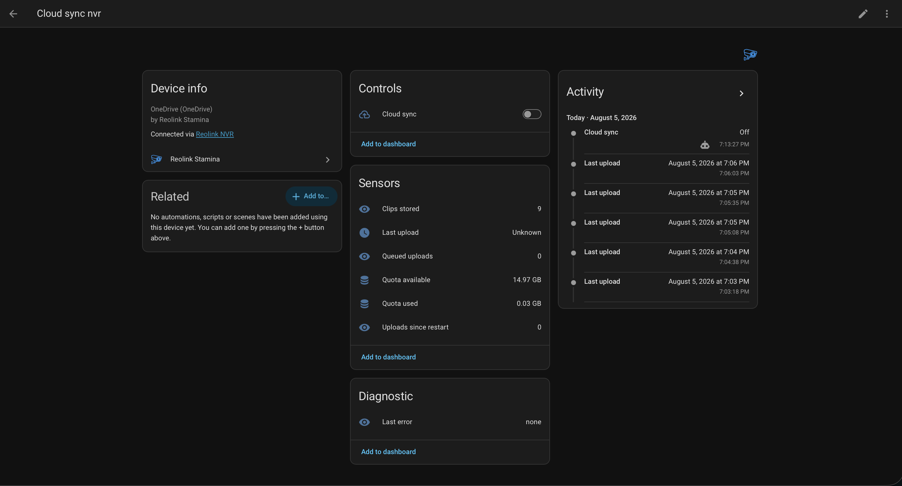

# Cloud sync

[← back to the README](../README.md)



An off-site copy of what mattered, so the evidence outlives the recorder it was written on.

One cloud sync per NVR, each with its own switch, quota and destination. It watches that recorder's detection sensors and, for each event, fetches a clip and uploads it to OneDrive.

Each sync becomes a device — shown under the NVR itself, the way the Reolink integration's own devices are — with a **switch** for whether new clips are *accepted*, which is what you automate from an alarm, and sensors for quota used and available, clips stored, queued uploads, uploads since restart, unusual uploads since restart, last upload and last error.

Clips are named date-first so any file browser lists them chronologically:

```
reolink/Reolink-NVR/240102_153045_recorder_front-door.mp4
reolink/Reolink-NVR/240102_031102_recorder_drive_u.mp4
```

A name ending `_u` was uploaded because the panel found that event [unusual for its camera](relevance.md), rather than because its kind was on the list.

When the quota is full, the **oldest clips are deleted** until the new one fits — and that is true of the `_u` clips too, so a busy camera can eventually retire the odd one. Give a recorder whose anomalies you want to keep a quota with room in it.

## How it behaves

- **The switch gates admission, not delivery.** Off stops new clips being accepted; anything queued still uploads. Disarming an alarm shouldn't discard footage of whatever made you disarm it. With *Also upload unusual events* on, the switch stops the **ordinary** traffic only — see below.
- **One event is one clip.** Several sensors fire on one arrival, and people step in and out of frame. A clip runs from the first detection to a margin after the *last* one clears; stepping away and back rejoins the same clip. A sensor stuck on is cut off after ten minutes.
- **One call at a time per recorder** — Reolink recorders are sprinters, not marathon runners. The clips themselves are handled in parallel, as far as the machine's free memory allows: a person crossing three cameras no longer means the third waits out the first two's uploads. How many at once is measured rather than configured, from what the machine has free and how big this recorder's clips turn out to be, and it is reported in the integration's diagnostics.
- **Cameras recording on events cost nothing extra:** their recording already *is* the clip, pre-record buffer included, so it goes up as it stands at wire speed.
- **Cameras recording 24/7 are cut down.** Only the clip's bytes are streamed and ffmpeg copies them into MP4 — nothing is re-encoded.
- **Nothing is written to your Home Assistant machine**; clips stream through memory to the cloud.
- **Clips land in Home Assistant's OneDrive app folder** — the access that integration holds, and what avoids a second app registration.

## Setting one up

*Reolink Stamina → **Add cloud sync***. Add one for each NVR you want backed up.

| Setting | Default | What it is for |
| --- | --- | --- |
| Recorder | First NVR not yet synced | Clips are uploaded for every camera on this NVR. Recorders that already have a sync are not offered again |
| Cloud account | — | An existing OneDrive integration; nothing to authorise again |
| Storage quota | 15 GB | How much this recorder's clips may occupy before the oldest are evicted |
| Detections to upload | person, vehicle, animal | Motion is offered, but fires constantly on most cameras and would spend the quota on empty footage |
| Also upload unusual events | off | A second rule: upload anything the panel marks as unusual for its camera, whatever kind it was — see below |
| Kinds that count as unusual | all of them | Which kinds that second rule may upload. Ignored while it is off |
| Resolution | Low | A fraction of the size, and plays everywhere |
| Seconds before / after | 10 s / 10 s | How much footage to keep either side of the event |
| Folder name | `reolink/<NVR name>` | Where the clips go; may be several levels deep |

Which recorder a sync serves is fixed once created — it owns the clips it has already uploaded, and re-pointing it would strand them where nothing will ever evict them. Everything else is editable under **Configure**.

## Uploading what is unusual

The list of detections to upload answers "what is worth keeping". It cannot answer "keep the odd one", because the odd one is usually a kind you decided *not* to sync — the motion at three in the morning on a camera whose motion fires four hundred times a day.

So there is a second rule, off by default. With it on, an event whose kind is not on the list is still uploaded when [the model marks it as unusual](relevance.md) for that camera. The two rules are ORed: what you chose is always uploaded, whatever the model thinks of it, and is never scored.

**It outranks the switch.** Switching this on is a standing instruction to keep the odd one out from this recorder, so an unusual event goes up even while that recorder's cloud sync switch is off — a disarmed house still gets an off-site copy of the thing that was not ordinary. The switch keeps its old meaning for everything else, and for a recorder that never switched this on it keeps its old meaning entirely: off means nothing is gathered at all.

That decision is made once, when the event opens, in both directions. A window that opened while the switch was off can never become an ordinary upload because somebody armed the alarm halfway through it.

Worth knowing before switching it on:

- **It does nothing for the first week or so.** Nothing can be called unusual until a camera has roughly a week and a few hundred detections behind it. Until then this rule uploads nothing, which is correct and looks exactly like it being broken.
- **The decision is made after the event, not during it.** The clip is scored once its detections have been journalled — about half a minute later, before anything is fetched — so an event that turns out to be ordinary costs one database read and no upload at all.
- **A recorder with this on is never entirely idle.** Windows are gathered whatever the switch says, so that they can be scored. Nothing is fetched or uploaded for the ordinary ones, but the syncer is doing work on a recorder whose switch reads off.
- **Choosing motion on a 24/7 camera means checking every detection it makes.** That is a lot of checking for a handful of clips. It is also the selection most likely to be worth it, so the choice is yours; the check is cheap and the upload is what costs.
- **The quota does not treat them specially.** An unusual clip is evicted by age like any other.

## Requirements

- An existing **OneDrive** integration in Home Assistant. Its credentials are reused, so there is nothing to authorise again.
- **ffmpeg**, but only for cameras recording 24/7 — their clips have to be cut out of a longer segment. A recorder whose cameras record on events needs nothing installed.
