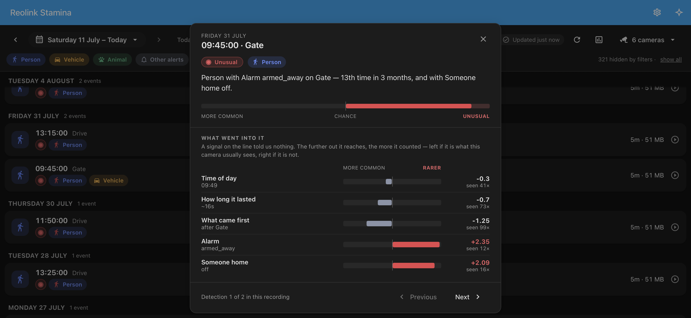

# Learning what is normal

[← back to the README](../README.md)

> **Beta.** It works end to end — it collects, it learns, and it marks, and it does so from the moment the panel is set up. What it has not had yet is months of real households, which is what the numbers behind it need in order to be right. Reports are the point.

A 24/7 recorder produces hundreds of detections a day, and almost all of them are the same detections it produced yesterday. The timeline puts them in one list; what it cannot do is tell you which three are worth opening.

This answers that without recognising anything. It keeps a record of what each camera normally sees, at what hour, on what sort of day, for how long — and an event is interesting when that combination is rare. A cat that crosses the drive at one in the morning every night has told you what normal looks like there. A person doing the same thing has not, and the difference falls out of counting rather than out of understanding anything.

That becomes a small mark on the row, a sentence saying why, and a filter that turns four hundred events into twelve.

## In the panel

**An *Unusual* mark** appears on a row when something inside it was rare for that camera. Only outliers are marked and nothing is ever labelled "common" — a mark on nineteen rows in twenty is noise people stop seeing, and it would devalue the twentieth.

**Tap the mark, or the ⓘ on any other row,** and you get the evidence: the sentence, a gauge showing how far past the cut it landed, and each signal drawn as a bar either side of a centre line — right of centre for rarer than chance, left for more common. Which signal made an event stand out is the longest bar, so it reads without arithmetic, and an ordinary event looks like four short stubs near the middle.

Beside each bar is the figure and the count it came from: *seen 122×* is a fact about that camera, not an estimate.

That detail view **works from the first day**, before anything can be marked. It is the honest answer to "is this doing anything?" — you can watch what it is collecting long before it has enough to have an opinion.

**How much it marks is yours to set** — *Only the strangest*, *Balanced*, or *More, including borderline ones*. Two things have to be true before a row is marked: the event has to be unusual **for that camera**, and it has to be unusual **at all**.

The second one is not a technicality. A quantile always cuts somewhere, however ordinary the week behind it, so a camera whose life is entirely predictable would still mark its top few percent. On a real installation of nine cameras those per-camera cuts came out *negative* — events more likely than chance were being marked, which is how a person seen for the seventh time in ten days ended up flagged. The setting moves an absolute floor instead, and on that same installation the three choices produced about 1.6, 4 and 9 marks a day across the whole property.

**An *Unusual* chip** in the filter row narrows the list to just those rows. While a camera is still learning it reads *Learning…* and is not clickable, which is true and better than a filter that can only return nothing.

**On the player's scrub bar**, a detection keeps the colour of what was detected and turns its dot red when the model marked it — two facts, two marks, neither displacing the other.

**The shape of the week counts too.** A departure that happens five days in seven makes the same departure on a Sunday worth noticing. A camera busy enough to have numbers behind each of the seven days is judged against the actual day; a quieter one against weekday versus weekend, and it moves from one to the other as it collects rather than at some threshold. Bank holidays are deliberately not built in — Home Assistant's own Workday sensor already knows your country's, so add it as a signal.

## What each camera has learned

Every camera row in the picker carries a small chart button, and the toolbar carries one for everything you have selected at once. Both open the same view: **when** that camera sees each kind of thing, hour by hour; **how long** those detections last; **what fired before them**; and **what every signal was doing** at the time. Across several cameras, *which camera* becomes a distribution of its own — on a property where one camera fires ten times more than the rest, that single row is usually the most useful thing on the screen.

This is the counterpart of the per-event breakdown. That one says why *this* event stood out; this one says what it stood out from. It is also the only way to notice that a camera has learned something wrong — a fortnight of scaffolding outside, a sensor that flapped for a week — which is otherwise invisible until it quietly stops marking anything.

## Counting your own signals

Point it at entities you already have and it counts them alongside the time and the duration, so *"a person on the drive while nobody is in"* becomes its own thing rather than just a person on the drive.

**Your cameras bring their own.** Each camera's floodlight, its siren and its day/night state are found automatically and attached to that camera — no picking, and none of them ends up counted against a camera on the other side of the house. Day/night earns its place: it is the camera saying it switched to infrared, which is darkness as that lens actually experienced it — under a porch light, behind a tree, facing east — rather than as an almanac calculated it for the whole property.

*Reolink Stamina → **Configure*** — one list per recorder, on the last page, for anything true of the whole property: whether anybody is in, whether the alarm is set, whether the gate is locked. One Home Assistant often covers more than one property, and whether anybody is home at the first says nothing about the second.

- **Nothing is assumed and nothing is pre-selected.** The model never interprets a signal; it counts the state as it finds it. So "is anyone home" works exactly as well as a named person, and which one suits your house is not this integration's business to guess.
- **Skippable.** Time of day and duration are most of the value on their own.
- **Numbers are counted too, in bands learned from their own history.** A continuous reading never repeats, so it could never be rare on its own — instead each sensor's own past is cut into five equal-sized bands, and an event is counted as the band it fell in. Learned rather than fixed, because any set of edges chosen in advance is wrong for every installation but one: *colder than four days in five* has to mean the same thing in Turin and in Oslo. A sensor that barely moves is left uncut, since five bands holding one value is a lot of arithmetic to say nothing.
- **The numbers offered are the ones measuring the world, not the wiring.** Temperature, humidity, light, rain, wind, pressure, air quality. On the installation this was measured against, "any sensor with a unit" would have offered 383 entities and all but a handful were voltage and energy counters; this offers 85, and they are the weather station and the room sensors.
- **A signal added later still gets its history.** Home Assistant has been recording that entity all along, so adding one reads back what it said and stamps it onto everything already collected. The alternative was being told to wait another week before a signal you just chose counted for anything.
- **The list is filtered to what could plausibly be a signal.** Your cameras' own detection sensors are hidden (counting a person as a signal against an event that is a person teaches it that a person is usually accompanied by a person), along with an alarm panel's individual zones, anything Home Assistant marks as diagnostic, and anything it has disabled. On the installation this was measured against, that turned 607 entities on offer into 172.

## What it keeps

What it keeps is a record of when your cameras see people, which is close to a record of when your house is empty. It starts collecting when the panel is set up — there is no switch, because a setup with six decisions in it is a setup most people get wrong — so what it keeps is worth reading before you install it.

- **It stays on your machine.** Its own small SQLite file in your Home Assistant configuration folder. No cloud, no account, nothing leaves the machine.
- **It is small.** A few megabytes a year for a busy recorder.
- **It is in your backups**, like the rest of that folder — deliberately, so a restored Home Assistant does not start again from nothing. The file is checkpointed before each backup so the copy is a usable database rather than one caught mid-write.
- **Removing the integration** deletes the file. That is the off switch, and it is the whole of it.
- **No faces, no number plates, no images.** It stores timestamps and which sensor fired. There is no picture in it, and none is planned.

## What it needs

**Nothing installed.** No ffmpeg, no models, no GPU, no cloud service — this is arithmetic over timestamps and it is meant to stay that way.

It also **does not depend on your recorder's retention**. Detections are read from Home Assistant's state machine as they happen, so a ten-day purge no longer takes the history with it. Home Assistant's own recorder is read exactly once, at first setup, to import whatever it still holds — however many days you have it set to keep, not an assumed ten. That import runs in the background and does not hold up a restart.

## Setting it up

There is nothing to switch on. The last page of *Reolink Stamina → **Configure*** — **Marking, and what else to count** — holds how much to mark and any household signals you want counted. Both are optional: it starts collecting either way, and the detail view on any row shows you what it has.

## How long before it says anything

A camera needs roughly **a week of history and a few hundred detections** before it can be compared against itself. Both, not either: a camera can have months behind it and still see too little to compare anything against, and that is reported as its own state rather than as silence. A week rather than a fortnight because what the days are for is having seen each day of the week once — a Saturday does not look like a Tuesday.

Your import shortens the wait by however much Home Assistant had already recorded — often ten days, more if you have set a longer retention.

## What it will not do

Worth saying plainly, because the obvious expectations are the wrong ones.

- **It will not recognise anyone.** No faces, no "that's the postman". It counts; it does not identify.
- **Common is not safe.** It ranks by how rare something is, and makes no claim about risk. A burglar at three in the afternoon in a busy driveway is statistically unremarkable.
- **It learns whatever it sees, including the bad.** A camera that has been firing on spiders every night for months has made spiders normal, and they will never be marked. That is correct behaviour, but it means its quality depends on your recorder's own detection quality.
- **Something genuinely new will be marked for a while.** A new family car stands out daily for a fortnight and then stops. Self-healing, and mildly irritating in the meantime.
- **It counts each signal separately, never in combination.** "A person" and "nobody home" are two facts added together, not one fact about the pair. That is deliberate — conditioning on three signals would cut six months of history into three weeks per bucket and the estimates would collapse — but it does mean it cannot learn that one particular *combination* is the strange one.
- **A person walking past three cameras is three events.** Grouping them into one arrival is not built.

## Where it is going

1. **The record.** ✅ The journal, and the one-off import of what Home Assistant already held.
2. **Scoring and the mark.** ✅ The rate model, the mark on the row, the sentence saying why, the detail view and the filter chip.
3. **Your own signals.** ✅ Pick entities per recorder, and each camera's own floodlight, siren and day/night state are found without being asked for. Numbers are counted in bands learned from each sensor's own history. History for a signal is read back from Home Assistant's recorder, so adding one counts immediately.
4. **What the picture says.** The coarse shape and position of what moved, so an unfamiliar vehicle at the gate can be told from a familiar one. This is the only part that will need ffmpeg.
