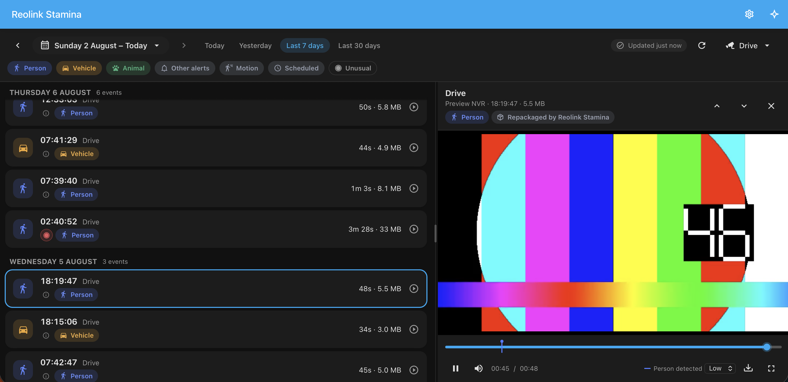

# The timeline

[← back to the README](../README.md)

Every camera's detections in one list, whatever recorder they hang off.

Pick cameras, then a day or a range. Filter chips toggle each kind of detection — person, vehicle, animal and other alerts are on by default, motion and scheduled recordings are off, because on a 24/7 recorder they outnumber real events many times over.

Rows say what fired and how often ("Person (2)"), the scrub bar marks each detection in the colour of what was detected, and clips open where the event is rather than at the top of a five-minute segment. **Download** saves the clip as MP4 in your choice of resolution.

## Worth knowing

- **Reach is about 30 days**, bounded by the Reolink search API and your HDD. Beyond that even stamina cannot help: the footage is gone.
- **Playback uses the low-resolution stream** where available. High resolution is H.265 at full sensor size — slow to open, undecodable in most browsers — so it is offered for downloads, not for watching. [Adaptive playback](#adaptive-playback) makes it watchable, and adds a resolution picker to the player. Some models and firmware serve H.265 on the low-resolution stream too, and there it is what (hopefully) makes *any* resolution play in Chrome or Firefox.
- **The player says how a clip reached you.** A badge reads *Direct play* when the footage came straight off the recorder with nothing in between, and names the conversion when adaptive playback had to step in.
- **Pinch to look closer.** Pinch, drag, or double-tap the picture to zoom in on a face or a number plate — useful on a phone, where the low-resolution stream is small and the screen is smaller. Ctrl-scroll or a trackpad pinch does the same on a desktop. A pill in the corner shows the level and taps back to the whole frame. Home Assistant switches its own page zoom off, so this is the panel's rather than the browser's.
- **The player is as wide as you want it.** On a desktop it opens beside the list, and the seam between the two is a handle — drag the grip in the middle of it to give the picture more room, or the rows more. It stops before the list stops being a list, remembers where you left it, and a double-click puts it back. Arrow keys move it too, once it has focus. On a screen taller than it is wide, or a window too small to hold both, the player opens over the list instead.
- **High-resolution downloads won't open in QuickTime or Preview.** The file is valid and VLC and browsers play it, but the H.265 these recorders produce stalls Apple's decoder however it is packaged. Convert once if you need to: `ffmpeg -i clip.mp4 -c:v libx264 -crf 20 -c:a copy out.mp4`.
- **Downloads take about as long as the clip** — no fast-forward on the recorder's treadmill.
- **Detection labels, counts and clip trimming need Home Assistant's recorder.** Disabled or purged, rows fall back to whatever the NVR itself reported and clips to whole segments.

## Options

*Reolink Stamina → **Configure***, over three pages: what is switched on, the player, and what the counting should watch.

Adaptive playback, hubs and standalone cameras, and learning what is normal used to be three switches here. They are not any more — a setup with six decisions in it is a setup most people get wrong, and each of them costs nothing until the situation it exists for turns up.

| Option | Default | What it is for |
| --- | --- | --- |
| Stream used for browsing | Low resolution | Low searches faster; playback and downloads can still use high |
| Event segment length | 5 min | How finely continuous recordings split into rows — the biggest change to how the list looks. 0 lists one row per recording file |
| Estimated pre-roll | 5 s | Where to draw the trigger marker for cameras that don't report their own pre-record time |
| Start playback before the detection | 30 s | Where the playhead opens inside the clip. Only the playhead — it does not change the clip |
| Clip: seconds before / after | 15 s / 15 s | Where a trimmed clip starts and ends on 24/7 footage |
| Hide scheduled recordings | on | Which filters start enabled. Off also brings back scheduled and unlabelled footage |
| Restrict to administrators | on | Recordings can be sensitive. Off lets non-admins open the panel |
| Verify the recorder's HTTPS certificate | off | On if you have installed a certificate on the recorder that this Home Assistant trusts, and want playback, downloads and cloud sync to check it. Off suits a recorder still carrying the self-signed certificate Reolink ships, which no verification can pass — and is what the Reolink integration's own calls to the device do regardless |

## Always on

Three things that need no configuring, listed here because they are worth knowing about.

### Adaptive playback

Playback normally goes straight from the recorder to the browser with nothing in between, and that stays the first thing tried. Some viewers for different reasons cannot use it, and none of them says so; each one just shows a black window.

So the player works down a ladder and stops at the first rung that draws a frame:

1. **The recorder's own stream**, demuxed in the browser. No server work at all.
2. **Repackaged** — ffmpeg changes the container and nothing else. This is what an iPhone needs for H.264: the phone's own decoder still does the work. Cheap on any machine.
3. **Re-encoded** — only for a codec the device itself cannot decode. Uses the machine's GPU where there is one (VideoToolbox, QSV, VAAPI, NVENC, Rockchip, Pi), falls back to software. Capped at 1080p, because re-encoding 8 megapixels in real time is beyond any machine Home Assistant usually runs on.

Needs ffmpeg for the second and third rungs; without it the first is all there is, which is what most desktop browsers use anyway. Downloads are unaffected: they are always the original footage.

### Hubs and standalone cameras

Home Hubs and cameras with their own SD card are listed alongside your recorders, tagged as the untested quantity they are. They answer the same search API, so the panel can browse them — but no hardware here has one, which is why reports are useful.

A camera that is already a channel on one of your NVRs is left out even so: it would be the same footage listed twice, under two names. Cloud sync remains NVR-only at the moment.

### Learn what is normal

Documented separately, because what it keeps deserves more than a paragraph: **[Learning what is normal](relevance.md)**.
